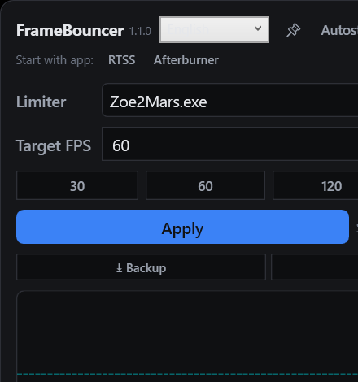

# FrameBouncer

**[English](README.md) | Deutsch**

Ein kleines Windows-Programm, um die **FPS in Spielen zu begrenzen** (z. B. 60, 120 oder 144),
damit der PC ruhiger läuft, kühler bleibt und weniger Strom verbraucht. Die Einstellungen
werden pro Spiel gespeichert und beim nächsten Start automatisch wieder angewendet.

**Frei nutzbar für alle** – MIT-Lizenz (siehe [LICENSE](LICENSE)).

## Screenshot

## Installation

1. Lade die neueste Version unter **GitHub Releases** herunter:
   `FrameBouncer-vX.Y.Z-win-x64.zip`
2. Entpacke das ZIP in einen beliebigen Ordner (z. B. `D:\Tools\FrameBouncer`) – es ist
   **eine einzige portable EXE** (`FrameBouncer.exe`), du kannst sie auch einzeln überall
   hin kopieren (Desktop, USB-Stick).
3. **RTSS** (RivaTuner Statistics Server, gratis auf guru3d.com) installieren und starten –
   ohne RTSS kann FrameBouncer kein FPS-Limit setzen.
4. `FrameBouncer.exe` starten – fertig, keine Installation nötig.

> Beim allerersten „Apply" kann einmal ein Windows-Sicherheitsfenster (UAC) erscheinen.
> Danach fragt FrameBouncer nie wieder.

## Bedienung

1. **Spiel auswählen:** Wähle dein laufendes Spiel aus der Liste oben (oder klicke auf
   **Fenster auswählen** und dann ins Spiel).
2. **FPS einstellen:** Wert eintippen oder Schnellwahl nutzen (30 / 60 / 120 / 144).
3. **Apply drücken** – das Spiel ist ab sofort begrenzt.

Das Profil wird automatisch gespeichert: Beim nächsten Start des Spiels gilt das Limit
wieder von selbst. Schließt du FrameBouncer, werden alle Limits wieder aufgehoben.

| Symbol / Button | Bedeutung |
|---|---|
| 📌 **Pin** | Fenster immer im Vordergrund |
| **Autostart** | Startet automatisch mit Windows |
| 🔔 **Tray** | Läuft nach ✕ im Infobereich weiter |
| ⭳ **Backup** / ⭱ **Restore** | Profile sichern / wiederherstellen |
| ⟳ **Updates** | Nach neuer Version suchen |

Unten zeigt das Programm live FPS, Frametime, 1%-/0,1%-Low und (wenn MSI Afterburner läuft)
GPU-/CPU-Temperatur.

## Anti-Cheat & Fair Play

RTSS begrenzt FPS, indem es eine **Hook-DLL in den Spielprozess injiziert**
(`RTSSHooks64.dll`). Genau das beobachten Anti-Cheat-Systeme (Easy Anti-Cheat,
BattlEye, VAC, Kernel-Anti-Cheats) — die Nutzung von RTSS in Online-Spielen birgt
daher ein **kleines, aber reales Risiko** von Fehlerkennung bis hin zu einem Bann;
manche Spiele starten gar nicht erst, solange RTSS läuft.

FrameBouncer selbst injiziert **nichts** in Spiele: Es schreibt nur RTSS-Profil-Dateien
und liest den RTSS-Shared-Memory für Diagnosen. Das Anti-Cheat-Risiko geht von RTSS
aus, nicht von FrameBouncer.

**Sichere Alternativen (ohne Prozess-Injektion):**

- **In-Game-FPS-Limiter** — die sicherste Option.
- **NVIDIA Max Frame Rate** (pro Spiel in der NVIDIA-Systemsteuerung / NVIDIA App) —
  auf Treiberebene.
- **AMD Frame Rate Target Control (FRTC)** — auf Treiberebene.

**Empfehlung:** Bei Singleplayer-Spielen ist RTSS unproblematisch. Bei
Competitive-Online-Spielen besser ein Treiber- oder In-Game-Limit verwenden — und
RTSS aktuell halten, wenn du es nutzt.

## Sprache

Oben im Fenster zwischen **Deutsch** und **English** umschalten. Die Auswahl wird gespeichert
und beim nächsten Start wiederhergestellt. Einstellungen und Profile bleiben unberührt.

## Deinstallieren

Einfach die EXE löschen. Deine Einstellungen und Profile liegen unter
`Dokumente\FrameBouncer` (`settings.json`, `Backups\`, `Updates\`) – auch diesen Ordner
kannst du löschen. Die EXE selbst bleibt dabei jederzeit portabel: Alle Daten liegen
immer in deinen Dokumenten, nie neben der EXE.

## Lizenz

[MIT](LICENSE) – du darfst das Programm frei nutzen, kopieren, verändern und weitergeben.
Entwickler-Details: [docs/architecture.md](docs/architecture.md).