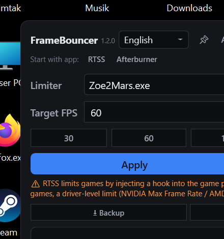

# FrameBouncer

**English | [Deutsch](README.de.md)**

A small Windows tool that **limits FPS in games** (e.g. 60, 120 or 144), so your PC runs
quieter, cooler and uses less power. Settings are saved per game and applied automatically
the next time the game starts.

**Free for everyone** – MIT license (see [LICENSE](LICENSE)).

## Screenshot

## Installation

1. Download the latest version from **GitHub Releases**:
   `FrameBouncer-vX.Y.Z-win-x64.zip`
2. Extract the ZIP to any folder (e.g. `D:\Tools\FrameBouncer`) – it is a **single portable
   EXE** (`FrameBouncer.exe`); you can copy the file anywhere (Desktop, USB stick).
3. Install and start **RTSS** (RivaTuner Statistics Server, free at guru3d.com) – without
   RTSS, FrameBouncer cannot set an FPS limit.
4. Start `FrameBouncer.exe` – done, no installation required.

> On the very first **Apply**, a Windows security prompt (UAC) may appear once.
> After that, FrameBouncer never asks again.

## Usage

1. **Select a game:** Choose your running game from the list at the top (or click
   **Pick window** and then click the game).
2. **Set FPS:** Type a value or use the presets (30 / 60 / 120 / 144).
3. **Press Apply** – the game is now limited.

The profile is saved automatically: the next time the game starts, the limit applies on its
own. When you close FrameBouncer, all limits are removed again.

| Icon / Button | Meaning |
|---|---|
| 📌 **Pin** | Keep the window always on top |
| **Autostart** | Start automatically with Windows |
| 🔔 **Tray** | Keeps running in the notification area after ✕ |
| ⭳ **Backup** / ⭱ **Restore** | Save / restore profiles |
| ⟳ **Updates** | Check for a new version |

At the bottom, the program shows live FPS, frame time, 1% / 0.1% lows and (if MSI
Afterburner is running) GPU / CPU temperature.

## Anti-Cheat & Fair Play

RTSS limits FPS by **injecting a hook DLL into the game process**
(`RTSSHooks64.dll`). That is exactly what anti-cheat systems (Easy Anti-Cheat,
BattlEye, VAC, kernel-level anti-cheats) monitor — so using RTSS in online games
carries a **small but real risk** of false-positive detection or even a ban, and
some titles block the game from starting while RTSS is running.

FrameBouncer itself does **not** inject anything into games: it only writes RTSS
profile files and reads RTSS's shared memory for diagnostics. The anti-cheat risk
comes from RTSS, not from FrameBouncer.

**Safe alternatives (no process injection):**

- **In-game FPS limiter** — the safest option.
- **NVIDIA Max Frame Rate** (per-game in NVIDIA Control Panel / NVIDIA App) —
  driver-side.
- **AMD Frame Rate Target Control (FRTC)** — driver-side.

**Recommendation:** For single-player games RTSS is fine. For competitive online
games, prefer a driver-level or in-game limiter — and keep RTSS up to date if you
use it.

## Language

Switch between **English** and **Deutsch** in the header of the app. The selection is saved
and restored on the next start. Settings and profiles are not affected by switching.

## Uninstall

Simply delete the EXE. Your settings and profiles are stored under
`Documents\FrameBouncer` (`settings.json`, `Backups\`, `Updates\`) – you can delete that
folder too. The EXE itself stays portable: all data always lives in your documents, never
next to the EXE.

## Disclaimer & Liability

FrameBouncer is provided **"as is", without warranty of any kind** (see
[LICENSE](LICENSE)).

- The author is **not responsible and not liable** for any consequences of using
  this program — including but not limited to **anti-cheat detections, game or
  account bans**, system instability, performance issues or data loss.
- FPS limiting via RTSS involves third-party software (RivaTuner Statistics
  Server) injecting into game processes. Using it in online or competitive
  games is **strictly at your own risk** — see
  [Anti-Cheat & Fair Play](#anti-cheat--fair-play).
- FrameBouncer itself only writes RTSS profile files and reads diagnostic data.
  It does not modify games, drivers or anti-cheat software.
- **If you play online games, prefer the in-game limiter or a driver-level
  limiter** and decide yourself whether to use RTSS.

## License

[MIT](LICENSE) – you may freely use, copy, modify and redistribute the program.
Developer details: [docs/architecture.md](docs/architecture.md).